# StreetSense

*A submission for Hackster.io's [Modern Java in the Wild](https://www.hackster.io/contests/modern-java-in-the-wild) contest, sponsored by Avnet and Oracle.*

Know what you're breathing, everywhere you go, not just at home.

## The story

### Why I built this

My apartment is thoroughly instrumented. Every room ties into my Home
Assistant setup, so I can tell you the CO2 level in my kitchen or the
humidity in my bedroom without thinking twice about it. It's a small
obsession of mine, but it means I always know exactly how good, or bad, the
air around me actually is.

Then I step outside for a run or a bike ride, and all of that knowledge just
disappears. I have no idea what I'm actually breathing, or how loud the
street I'm running down really is. A couple of my cycling friends have asked
me some version of "is it actually worth exercising outside today," and none
of us have ever had a real answer, just a weather app and a shrug.

I'm studying electrical engineering, so instead of leaving it at that, I
decided to build the answer myself. That's StreetSense: a sensor node small
enough to clip on before a run, paired with a phone that already goes
everywhere with you anyway.

### How it works

The sensor node measures particulate matter, volatile organic compounds, and
noise, once a second, and streams it to your phone over Bluetooth. You tag
the outing as a run, a ride, or a walk, and the app carries it through what I
call a session.

The interesting part isn't the raw numbers. Nobody thinks in micrograms per
cubic meter. So the backend turns a session into a dose: not "the air was 34
µg/m³ of PM2.5" but "you inhaled 0.6 mg of it, and the worst 30 seconds was
that one junction." It weighs the reading by how hard you were probably
breathing, since a jog through mediocre air costs you more than a walk
through the same air. Sessions stack up over time, so you can compare this
route against that one, or this morning against last week.

None of this needs your exact location. The app rounds every reading to a
grid cell about 110 meters wide before it sends anything, and your real
route never leaves your phone.

## System architecture

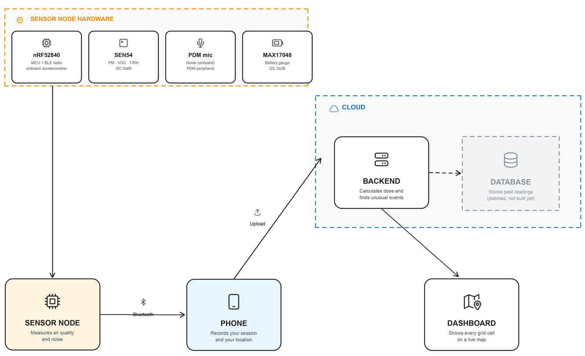

StreetSense has four parts, and each one has exactly one job: the sensor
node measures, the app carries a session and protects your location, the
backend turns a reading into a dose and a verdict, and the dashboard shows
the crowd layer live. Each is broken out below with the specific hardware,
the communication protocols, and the reasoning behind each choice.

## Sensor node

A single board carries the whole sensing job, sampling once a second and
pushing every reading out over Bluetooth Low Energy. It has no idea what a
session or a dose is, it just measures and broadcasts. Keeping the firmware
this simple was deliberate: the only job it has is packing sensor values
into a fixed size packet, so there is nothing here that can drift out of
sync with what the app or the backend thinks a reading means.

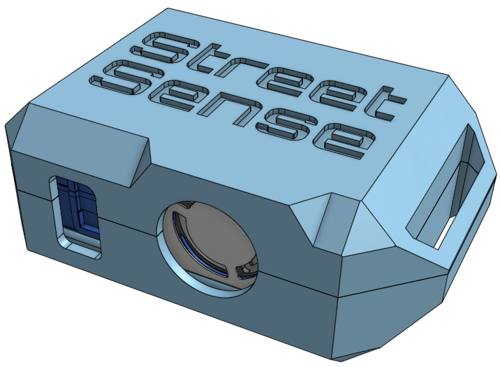

The case is 3D printed and designed in Onshape alongside the internal
layout, with two separate openings for the SEN54 rather than one: the round
hole is the fan outlet, and the rectangular slot next to it is the air
inlet. Keeping them apart matters, Sensirion's own design guidance for this
sensor calls for the inlet and outlet to be sealed off from each other, so
outgoing air can't get pulled straight back in and thrown off the next
reading.

Here's what actually ended up inside it. It's a bit tight, but all the
electronics can be squeezed in:

<table>
<tr>
<td>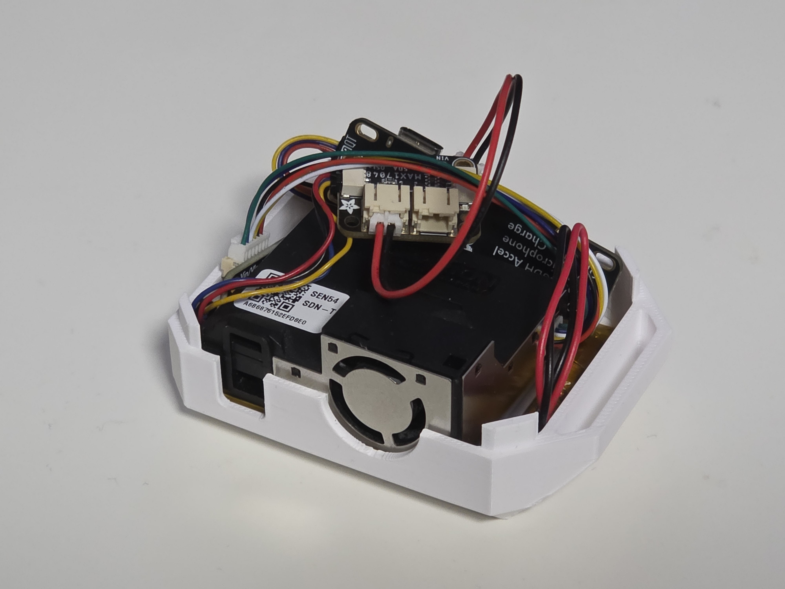</td>
<td>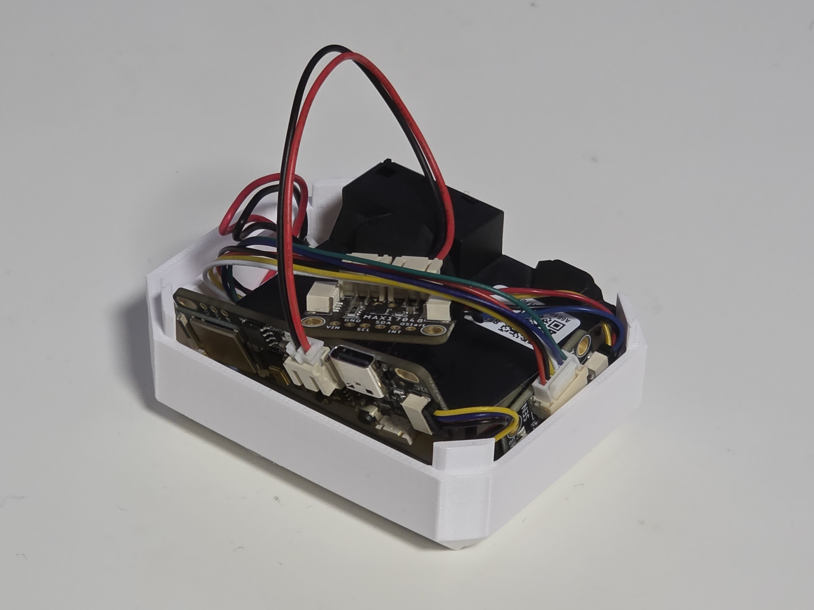</td>
</tr>
</table>

And closed up, it looks like this:

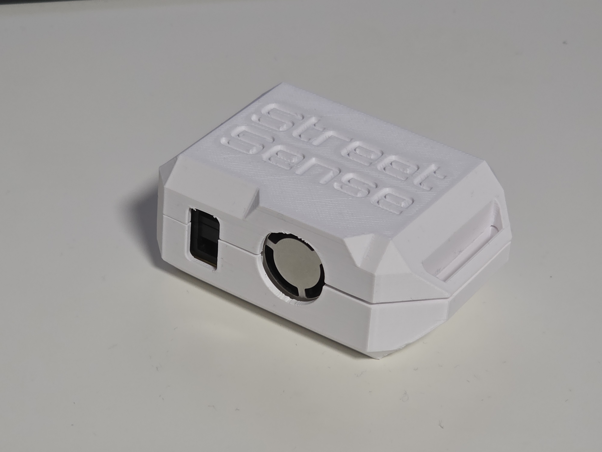

### Hardware

| Component                                                                      | Role                                                                                                                                                                                                                                                                     | Protocol                                                                                                                                                                                                  |
| ------------------------------------------------------------------------------ | ------------------------------------------------------------------------------------------------------------------------------------------------------------------------------------------------------------------------------------------------------------------------ | --------------------------------------------------------------------------------------------------------------------------------------------------------------------------------------------------------- |
| [Adafruit LED Glasses Driver, nRF52840](https://www.adafruit.com/product/5217) | MCU and BLE radio. Bluetooth Low Energy on this chip draws very little power, which matters on something running off a small battery, and the board happens to carry an onboard PDM digital microphone and an accelerometer too, so noise sensing needed no extra parts. | BLE (peripheral), and the I2C host for the two sensors below                                                                                                                                              |
| Sensirion SEN54                                                                | Particulate matter (PM1, PM2.5, PM4, PM10), VOC index, temperature, humidity                                                                                                                                                                                             | I2C (a simple two wire protocol many sensor chips use to talk to a microcontroller), via a STEMMA QT adapter breakout, a small keyed connector so the cable can't be plugged in backwards, address `0x69` |
| Onboard PDM digital microphone                                                 | Noise level                                                                                                                                                                                                                                                              | PDM (pulse density modulation, a common way small digital microphones encode audio), decoded on chip via the nRF52840's own PDM peripheral                                                                |
| [Adafruit MAX17048 fuel gauge](https://www.adafruit.com/product/5580)          | Battery voltage, state of charge, charge rate                                                                                                                                                                                                                            | I2C via STEMMA QT, address `0x36`, sharing the bus with the SEN54 at a different address                                                                                                                  |
| 2500 mAh, 3.7V LiPo cell                                                       | Power                                                                                                                                                                                                                                                                    | Wired to both the driver board's onboard charge circuit and directly across the MAX17048's sense leads                                                                                                    |

The SEN54 needs its own driver to talk I2C correctly, checksums included, so
the firmware uses [Sensirion's own driver](https://github.com/Sensirion/arduino-i2c-sen5x)
for it rather than a hand rolled one, and Adafruit's own driver for the
MAX17048 for the same reason: reimplementing either from scratch would mean
redoing work already verified against this exact hardware, with no easy way
to check a hand written version except against the same hardware Sensirion
and Adafruit already tested theirs on. The firmware also runs the SEN54's
fan and laser scattering unit rather than its lower power mode without
particulate readings, since particulate matter is the entire reason this
sensor is here.

The noise figure comes from a flat, unweighted loudness reading off that
onboard microphone, converted to an approximate decibel figure using the
microphone's own datasheet sensitivity. There is no frequency weighting and
no calibration against a reference microphone, so it's better for comparing
one place or route against another than for a certified sound measurement.

Battery state of charge on the MAX17048 is a voltage curve estimate rather
than a precise coulomb count (tracking current in and out directly), and the
firmware treats it that way instead of presenting it as exact. The driver
board has no dedicated pin for detecting charging, so that state is inferred
from USB power being present together with a positive charge rate, and the
raw charge rate also rides along over Bluetooth so that inference can be
checked rather than taken on faith.

The 2500 mAh cell is the balance point for something worn while moving: big
enough to last a long outing without a recharge partway through, light
enough to still be worth clipping on before a run in the first place.

### Communication protocol

The node advertises a custom Bluetooth Low Energy GATT service, the
standard way two BLE devices agree on what their data looks like, with a
single notify characteristic: a named value the phone subscribes to once
and then receives automatically, once a second, without asking again. That
carries a fixed, packed binary packet, chosen over sending JSON text since
parsing JSON on a small microcontroller is unnecessary overhead once both
sides already agree on a fixed layout.

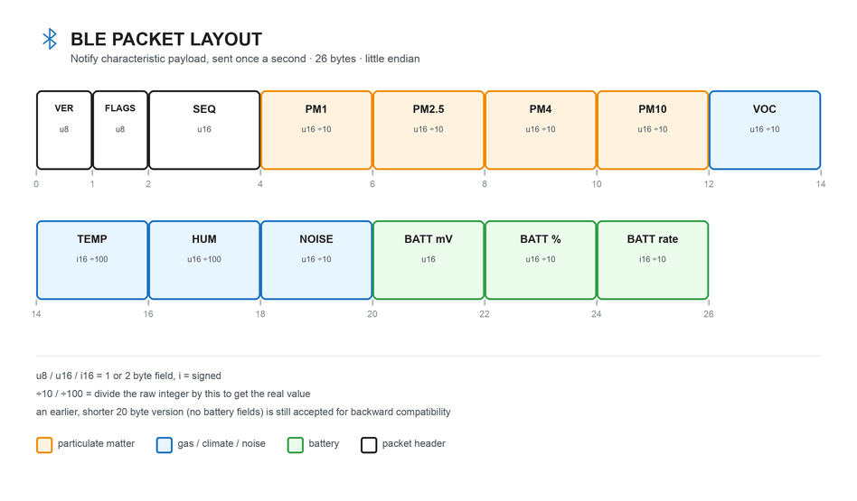

The current wire format packs everything into 26 fixed size, fixed scale
bytes. An earlier, shorter 20 byte version was deliberately sized to fit
inside Bluetooth's default message size limit (called the MTU) so a
reading never needed to negotiate a larger one. Adding battery data needed
more room than that left, so the newer format spends the negotiation the
older one was built to avoid, and it carries a version number so the
backend can still read packets from older firmware without any special
handling. This exact layout is also checked byte for byte by matching tests
in the firmware, the app, and the backend, so if the three ever disagreed
about the format, a test would catch it before a device did.

### Firmware

The firmware is C++ via PlatformIO and the Arduino framework, not Java. A
JVM isn't a realistic option on a microcontroller this size within its
power and flash budget, and every hardware driver this project depends on,
for the radio, the microphone, and both I2C sensors, is C++ and Arduino
native. Java's role in this project is entirely in the backend, where it
has real preview features to show off.

## App

The Android app is the sensor node's only Bluetooth connection, and the
place your session actually lives. It scans for the node, connects, and
draws live values on screen once a second. It also owns the one privacy
critical step in this whole pipeline: before anything leaves your phone,
the app rounds your GPS position down to a grid cell about 110 meters wide.
Your exact route is drawn from a trace kept only on your phone, and it is
never uploaded.

<table>
<tr>
<td>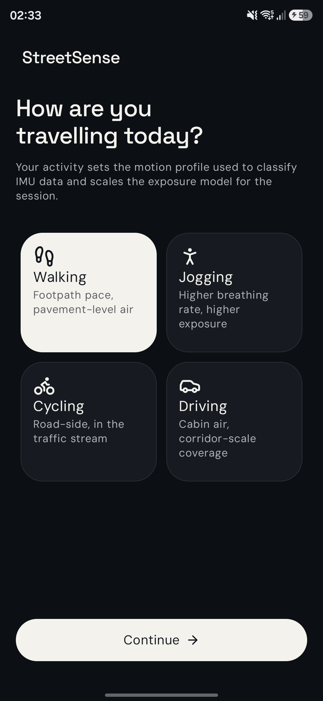 Pick your activity</td>
<td>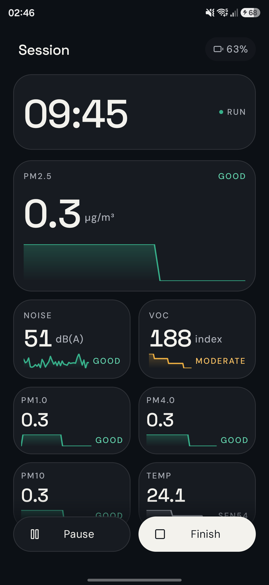 Live readings</td>
<td>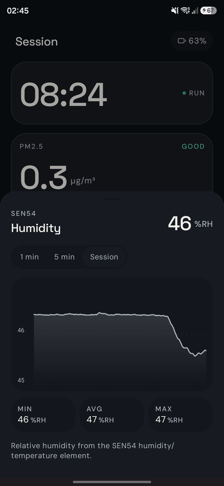 Metric detail</td>
<td>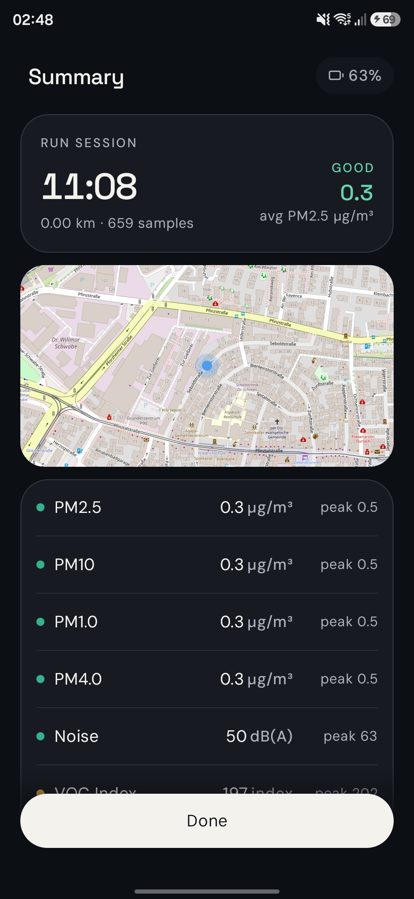 Session summary</td>
</tr>
</table>

The app runs on Java 17 rather than Java 26, and that isn't a choice:
Android's own build tooling doesn't support anything newer yet. The
backend's Java 26 claim and the app's Java 17 ceiling are simply two facts
about two separate toolchains.

The app also only supports Android 12 and newer, which skips an entire
older branch of how Android used to handle Bluetooth permissions (older
versions asked for location permission just to scan for BLE devices,
current versions have dedicated Bluetooth permissions instead), a real
simplification at the cost of older phones.

The session map renders OpenStreetMap tiles through an open source library
rather than a commercial maps SDK, mainly so running the app doesn't need
an API key or a billing account, which matters for a project meant to be
cloned and run by someone else, not just demoed from one already configured
machine.

## Backend

This is where Java 26 lives, and where a raw reading turns into something a
person can actually act on. The build's toolchain declaration requires JDK
26, and a committed `build.log` file is the actual `java --version` output
from that exact toolchain, written automatically so the claim has a receipt
rather than resting on a version number in a config file.

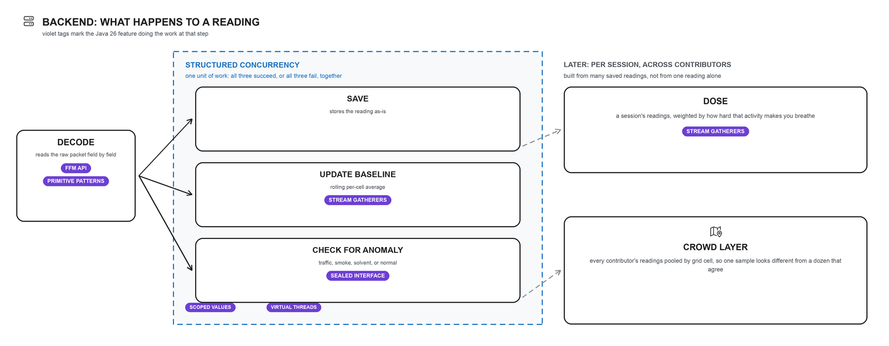

Two preview features exist only in Java 26, and both do real work here, not
just a token appearance:

- **Structured Concurrency.** Every incoming reading kicks off three jobs at
  once: save it, update the rolling baseline, and check it for anything
  unusual. Structured Concurrency treats those three as a single unit of
  work. If one fails, they all fail together, so the system never ends up
  half updated with a reading saved but no baseline to match it.
- **Primitive types in patterns and switch.** Readings arrive as a mix of
  numeric types depending on the client. One exhaustive switch statement now
  handles all of them, replacing what used to be a small pile of
  `instanceof` checks.

There was a third Java 26 preview I tried and then dropped: Lazy Constants,
for one time grid setup. Once I actually wrote it out, a plain constant did
the exact same job with none of the complexity, so I cut it rather than keep
it around just to say I used it.

The rest of the backend leans on Java features that finalized a little
earlier, and gives the two preview features an actual domain to work in
instead of a toy demo:

- The **Foreign Function and Memory API** decodes the raw sensor packet
  coming off the firmware, matching its C struct layout field for field.
- **Scoped Values** bind session context once, so every job forked from
  Structured Concurrency can read it without threading it through every
  method call.
- **Stream Gatherers** compute the rolling per block baseline and the dose
  itself, both of which need to fold over a moving window, not just reduce
  a list.
- A **sealed interface** with exhaustive pattern matching classifies what
  actually changed in the air: a traffic spike looks different from smoke,
  which looks different from a solvent smell, and the code has to prove it
  handled every case. Every verdict carries the numbers it was decided
  from, so the reasoning can be checked against what is on screen rather
  than taken on faith.
- **Virtual threads** are what make forking three jobs per reading cheap
  enough to not matter under load.

It also turns a session's worth of readings into a dose, weighted by a
published ventilation multiplier per activity, and pools every
contributor's readings into a shared crowd layer, so a grid cell one person
has sampled once looks different from one a dozen people agree on.

Spring Boot is the only runtime dependency in the backend: no separate
database layer, template engine, or frontend build (more on that in
Dashboard below). Keeping that list short was deliberate for a Java
language contest, so the Java 26 features are doing the visible work
instead of a library doing it for them.

## Dashboard

The dashboard is served straight off the backend, with no separate service,
build step, or framework sitting in between: the same vanilla HTML, CSS, and
JavaScript that keeps the backend's own dependency list short, just applied
to the frontend half of the project too. It is the live public face of the
crowd layer, a fullscreen branded map that renders every grid cell colored
and sized by how much data backs it up, so a block one person sampled once
looks visibly different from one a dozen people agree on.

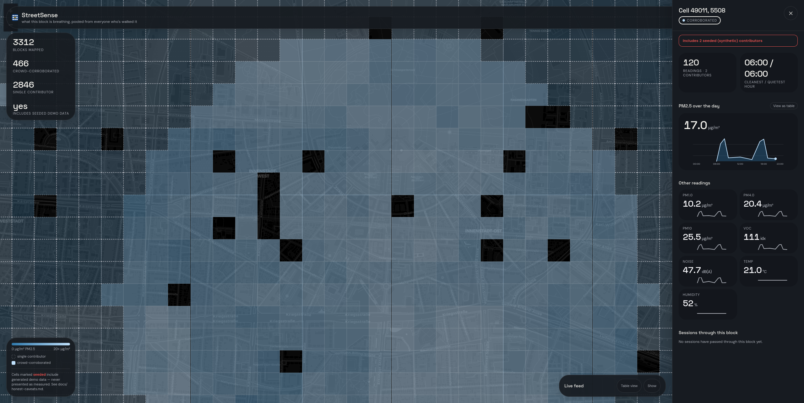

Confidence is drawn, not just labeled. A corroborated cell, the common case
across most of the grid, gets a solid hairline border and fills in at 50%
opacity; a single-contributor cell is still worth flagging as provisional,
so it keeps a dashed, more visible edge at a lighter 30%. Cells tile
edge-to-edge with no gaps between them, which took its own fix: a naive grid
stretches into rectangles away from the equator, since a degree of longitude
covers less real-world distance than a degree of latitude the further north
or south you go. Each cell's longitude span is widened by the same secant
correction Web Mercator's own projection applies, so a block reads as a true
square in real-world metres and, because that projection is conformal, in
pixels too, at any zoom level.

Clicking a cell opens a detail panel with everything the map's color alone
can't show: the full eight-channel pollutant breakdown, a PM2.5-over-the-day
chart with an hour-by-hour table view underneath it, the cleanest and
quietest hour recorded there, and the sessions that actually passed through
that specific block, scoped to the readings taken in that cell rather than
the whole route someone was on. A live feed at the bottom of the screen
lists readings as they arrive, with the same list-or-table toggle as the
chart above it.

Updates reach the page through Server Sent Events, a simple way for a
server to keep pushing new data to an already open web page without that
page repeatedly asking for it. Data only ever flows one direction here,
from backend to browser, so this fit without needing the two way machinery
of something like WebSockets, and Spring already has it built in, so no
extra library was needed to wire it up. A reading someone takes right now
shows up on screen without a page refresh.

## The bigger idea

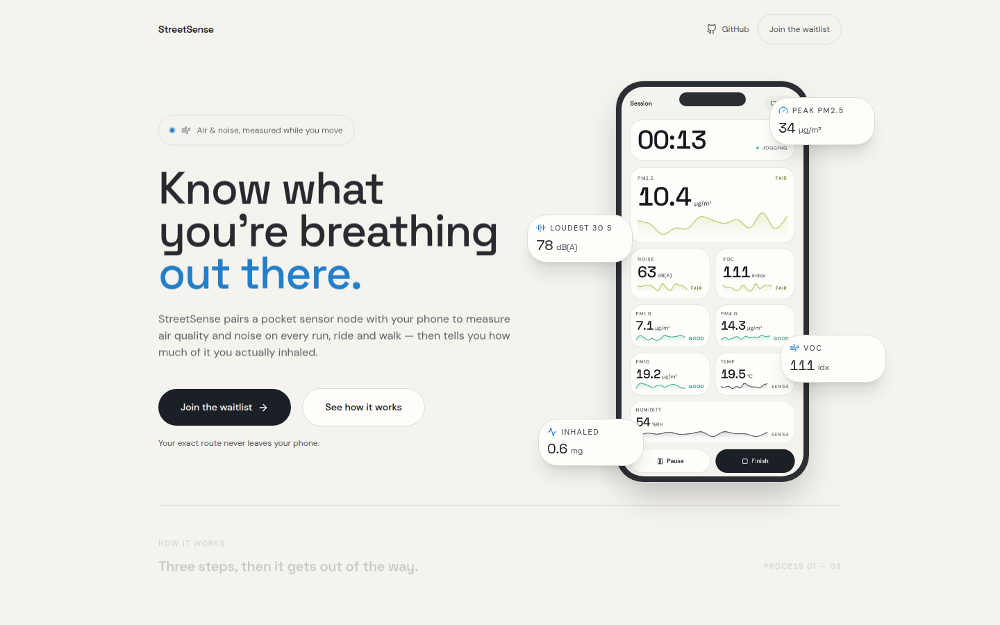

One sensor node answers one person's question. A few hundred of them in the
same city start answering everyone's.

Every reading gets pooled into a shared map, built from grid cells rather
than exact coordinates, so a street your phone has never walked down can
still show a result, because somebody else's phone already has. The
dashboard even shows the difference between a block one person sampled once
and one that a dozen people agree on, so you can see how much to trust it.

Compare that to how cities check air quality today: a handful of expensive,
fixed reference stations, each covering a tiny radius, updating once an
hour, and standing exactly still. StreetSense flips that. The readings are
individually noisier, but there are thousands of them, moving, updating
live, and covering the actual streets people use instead of the streets a
monitoring budget could afford.

At real scale, that stops being a fitness app and starts being a live,
street level dataset that doesn't exist anywhere today, built by the people
who are already outside instead of a fleet of hardware a city would have to
buy and maintain. Researchers get an exposure signal instead of a nearest
station guess. City planners can point at the exact junction that needs a
fix, not just the general neighborhood. And every single contributor still
gets the thing that got them to install the app in the first place: whether
today is actually worth running outside for, and which way to go.

[streetsense.tech](https://streetsense.tech/) has more on where this project is headed, plus a waitlist if you would like early access.

## Demo video

**[ADD VIDEO LINK before you submit]**

## Limits

I'd rather list what this doesn't do than have someone discover it later.

- The SEN54 is a consumer sensor, not lab equipment. It's good for comparing
  a place against its own history, not for a medical or regulatory claim.
- The noise reading has no frequency weighting filter and no per unit
  calibration, so it's not a certified sound level measurement. Use it to
  compare one route to another, not to argue a legal decibel limit.
- The event classifier runs on fixed rules over real sensor cross products,
  not a trained model, and every decision it makes shows the exact numbers
  it was based on.
- Dose is a population level estimate. It doesn't know your fitness level or
  your actual breathing rate, only a published ventilation multiplier for
  your activity type.

## Next steps

A few friends have already been taking this out on actual runs and rides,
and the feedback so far has been encouraging enough that this doesn't feel
like a project that ends at the submission deadline. There's a lot more
room to grow here:

- A real Postgres database, so the backend can keep more than a short
  rolling window of readings.
- Offline buffering on the app, so a dropped connection doesn't just lose a
  reading.
- Motion tagging from the onboard accelerometer, to tell a stationary
  reading apart from one taken mid stride, which matters most for noise.

I plan to keep building on this after the contest wraps up, since the idea
has more potential than a couple of weeks can show. If you're reading this
well after the submission date and the repository has moved on from what's
described here, that's why. It would be a shame to stop now.